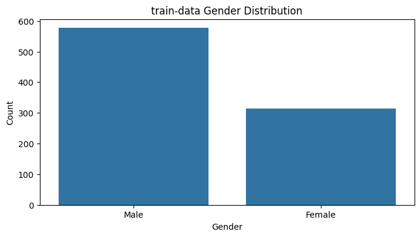

# タイタニックデータセットにおける生存分析

このプロジェクトでは、ロジスティック回帰を用いてタイタニック号の乗客データから生存に関わる要素の重要度を測定し、予測モデルを構築します。

## 分析手順

1. **データの前処理**
   - 年齢(`Age`)と運賃(`Fare`)の欠損値を中央値で補完。
   - 性別(`Sex`)を数値にエンコーディング（男性を0、女性を1とする）。

2. **特徴量選択**
   - 分析に使用する特徴量は `Pclass`, `Sex`, `Age`, `Fare` です。

3. **モデルの構築と訓練**
   - `sklearn`ライブラリの`LogisticRegression`クラスを使用。
   - データを訓練セットとテストセットに分割。

4. **モデルの評価**
   - 精度(`Accuracy`)、混同行列(`Confusion Matrix`)、分類レポート(`Classification Report`)による評価。

## 結果の視覚化

1. **年齢分布**
   - 
2. **乗船港別の分布**
   - 
3. **特徴量の重要度**
   - 
4. **性別分布**
   - 

## 仮想環境のセットアップ

プロジェクトの依存関係を管理するためにPythonの仮想環境を設定する手順は以下の通りです。

### 1. 仮想環境の作成

```bash
python -m venv myenv
```
### 2. 仮想環境のactivate
```bash
myenv\Scripts\activate
```

```bash
source myenv/bin/activate
```
### 3. 依存関係のインストール
```bash
pip install -r requirements.txt
```
## 使用ライブラリ

- Python
- Pandas
- Matplotlib
- Seaborn
- scikit-learn

##　筆者の環境

- Python 3.9.13
- Windows 11
- Vscode


