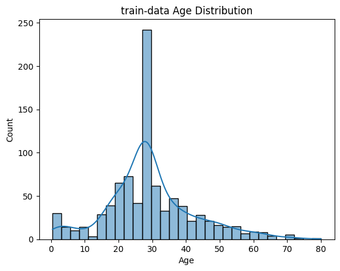
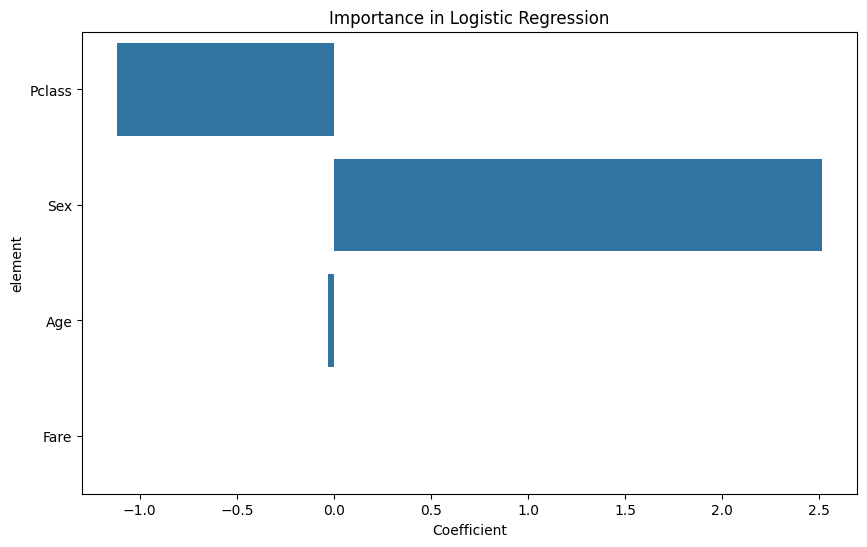

# タイタニックデータセットにおける生存分析

このプロジェクトでは、回帰分析を用いてタイタニック号の乗客データから生存に関わる要素の重要度を測定します。

## プログラムの説明
**01_Permulation_Feature.ipynb**
- train.csvのデータの内容を図として表示させるプログラム

**02_Permulation_Feature.ipynb**
- ロジスティック回帰によるモデル化と各特徴量の分析

## 分析手順

1. **データの前処理**
   - 年齢(`Age`)と運賃(`Fare`)の欠損値を中央値で補完。
   - 性別(`Sex`)を数値にエンコーディング（男性を0、女性を1とする）。

2. **特徴量選択**
   - 分析に使用する特徴量は `Pclass`, `Sex`, `Age`, `Fare` です。
   - `Pclass`はチケットの等級、`Sex`は性別、`Age`は年齢、`Fare`は運賃を示している。

3. **モデルの構築と訓練**
   - `sklearn`ライブラリの`LogisticRegression`クラスを使用。
   - データを訓練セットとテストセットに分割。

4. **モデルの評価**
   - 精度(`Accuracy`)、混同行列(`Confusion Matrix`)、分類レポート(`Classification Report`)による評価。

## train.csvの視覚化

1. **年齢分布**
- 
2. **乗船港別の分布**
- 
3. **性別分布**
- 

## ロジスティック回帰分析による各要素の重要度の結果
1. **特徴量の重要度**
- 
   - 女性という性別が生存予測に強い影響を及ぼしている。また男性より女性の生存傾向が強かったことを示している。
   - チケットの等級が上がることで、生存傾向が高いことを示している。これはデータの前処理で、1等級から3等級の数字を回帰予測に用いているため。
   - 年齢と運賃には、相関関係はなかった。
   
## 仮想環境のセットアップ

プロジェクトの依存関係を管理するためにPythonの仮想環境を設定する手順は以下の通りです。

### 1. 仮想環境の作成
環境名 `myenv`は例として挙げています。
```bash 
python -m venv myenv
```
### 2. 仮想環境のactivate
Windows:
```bash
myenv\Scripts\activate
```
macOS and Linux:
```bash
source myenv/bin/activate
```
### 3. 依存関係のインストール
```bash
pip install -r requirements.txt
```
## 使用ライブラリ

- Python
- Pandas
- Matplotlib
- Seaborn
- scikit-learn
- Juypter

## 筆者の環境

- Python 3.9.13 (3.10で仮想環境の作成に問題があるため非推奨)
- Windows 11
- Vscode


